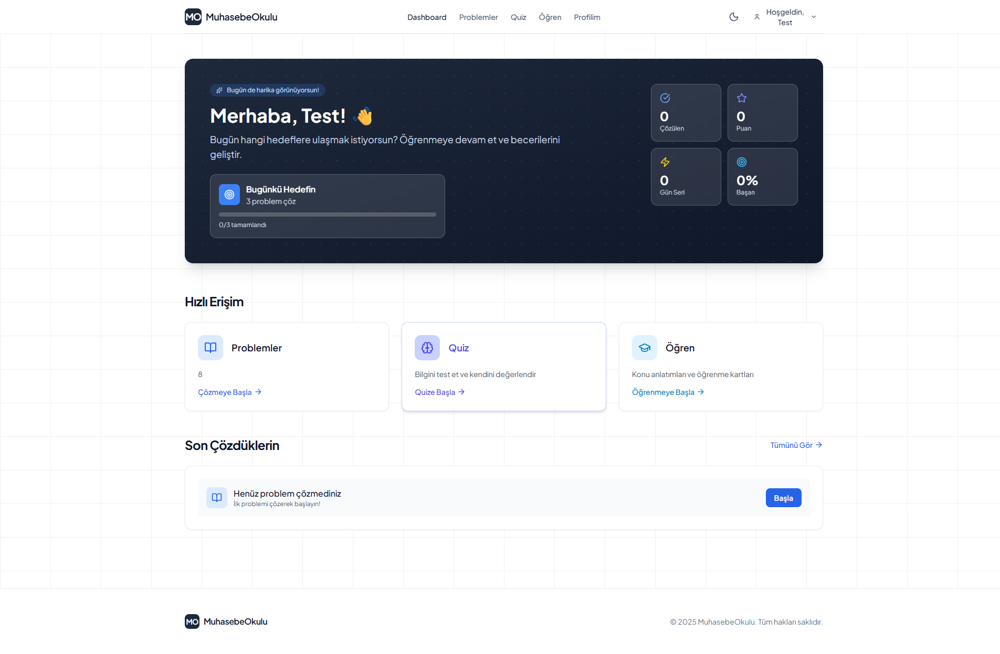
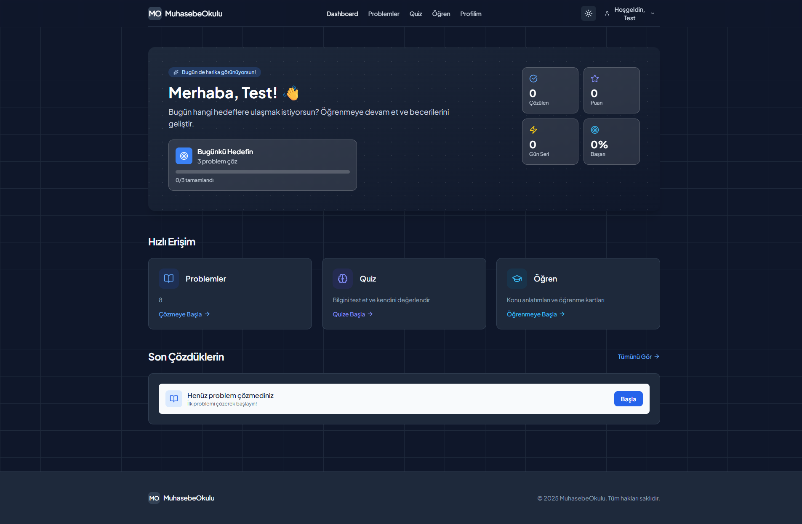

# 📚 MuhasebeOkulu

> Modern ve interaktif muhasebe eğitim platformu. Gerçek dünya senaryoları ile pratik yapın, quizler çözün ve ilerlemenizi takip edin.

## 🎯 Nedir?

**MuhasebeOkulu**, muhasebe öğrenmek isteyenler için tasarlanmış interaktif bir eğitim platformudur. Teorik bilgileri pratik uygulamalarla pekiştirmenize, gerçek muhasebe problemlerini çözmenize ve ilerlemenizi takip etmenize olanak sağlar.

**Kimler İçin:**
- Muhasebe öğrencileri
- SMMM/YMM sınavına hazırlananlar
- İşletme ve iktisat bölümü öğrencileri
- Mesleki gelişim arayan muhasebeciler
- Muhasebe öğrenmek isteyen herkes

## ✨ Özellikler

### 📝 Problem Çözme
Yevmiye kayıtları ile gerçek muhasebe senaryoları çözün. Her problem, gerçek iş dünyasından alınmış durumları içerir. Çözümleriniz otomatik olarak kontrol edilir ve anında geri bildirim alırsınız.

### 🎯 Quiz Sistemi
Çoktan seçmeli sorularla bilginizi test edin. Her quiz sonunda detaylı analiz ve doğru cevaplarla öğrenme sürecinizi destekleyin. Zamanlı quizlerle sınav ortamını simüle edin.

### 📖 Çalışma Kartları
Konu bazlı interaktif öğrenme materyalleri ile adım adım ilerleyin. Her kart, kavramları anlamanızı kolaylaştırmak için özenle hazırlanmış açıklamalar ve örnekler içerir.

### 📊 İlerleme Takibi
Kişisel dashboard'unuzda çözdüğünüz problemleri, puanınızı, başarı oranınızı ve güçlü/zayıf yönlerinizi görün. Hangi konularda daha fazla pratik yapmanız gerektiğini keşfedin.

### 🏆 Başarı Sistemi
Çözdüğünüz her problem için puan kazanın. Günlük hedefler belirleyin ve seri oluşturarak motivasyonunuzu yüksek tutun.

### 🌙 Dark Mode
Modern ve göz dostu karanlık tema ile gece çalışmalarınızı daha konforlu hale getirin. Tek tıkla açık/karanlık tema arasında geçiş yapın.

## 📸 Ekran Görüntüleri

### Ana Sayfa

### Dashboard - Light & Dark Mode

### Problem Çözme

### Quiz Sistemi

### Çalışma Kartları

## 🚀 Nasıl Kullanılır?

### 1️⃣ Kayıt Olun
Hemen kayıt olun ve öğrenmeye başlayın. İlk kayıt olan kullanıcı otomatik olarak admin yetkisi alır.

### 2️⃣ Dashboard'a Göz Atın
Kayıt olduktan sonra kişisel dashboard'unuzda günlük hedeflerinizi, çözdüğünüz problemleri ve ilerlemenizi görün.

### 3️⃣ Problem Çözün
**Problemler** bölümünden istediğiniz zorluk seviyesindeki problemleri seçin:
- **Kolay**: Temel muhasebe kayıtları
- **Orta**: İşlem kombinasyonları ve dönem sonu kayıtları
- **Zor**: Karmaşık muhasebe senaryoları ve konsolidasyon

Her problemde:
- Detaylı soru açıklaması
- İpucu bölümü
- Yevmiye kaydı giriş formu
- Otomatik kontrol ve geri bildirim

### 4️⃣ Quiz'lere Katılın
**Quiz** bölümünden konu bazlı testlere katılın:
- 10 soruluk testler
- Zamanlı değerlendirme
- Anında sonuç ve doğru cevaplar
- Detaylı performans analizi

### 5️⃣ Öğrenme Kartlarıyla Çalışın
**Öğren** bölümünden konu anlatımlarına erişin:
- Yapılandırılmış ders içerikleri
- Adım adım açıklamalar
- Örneklerle pekiştirme
- İlerleme takibi

### 6️⃣ İlerlemenizi Takip Edin
**Profilim** sayfanızda:
- Çözdüğünüz problemler
- Toplam puanınız
- Başarı oranınız
- Güçlü ve zayıf yönleriniz
- Son aktiviteleriniz

## 🎓 Admin Özellikleri

Platform yöneticileri için gelişmiş özellikler:
- **İçerik Yönetimi**: Problem, quiz ve öğrenme kartları ekleme/düzenleme
- **Kullanıcı Analitikleri**: Platform kullanım istatistikleri
- **Bulk Import**: JSON dosyası ile toplu içerik yükleme
- **Dashboard**: Genel platform metrikleri

## 🛠 Teknoloji

**Backend**: Spring Boot 3.5.7, Java 17, PostgreSQL 15, Spring Security + JWT
**Frontend**: Vanilla JavaScript, Tailwind CSS, Lucide Icons
**Güvenlik**: JWT authentication, role-based access control, BCrypt şifreleme

## 📝 Lisans

MIT License - Detaylar için [LICENSE](LICENSE) dosyasına bakın.

## 👤 Geliştirici

**Abdul Kerim Çetinkaya**
GitHub: [@abdulkerimcetinkaya](https://github.com/abdulkerimcetinkaya)

---

⭐ Bu projeyi beğendiyseniz yıldız vermeyi unutmayın!
