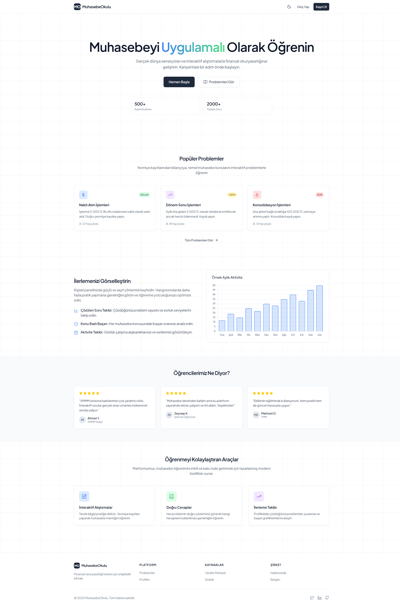
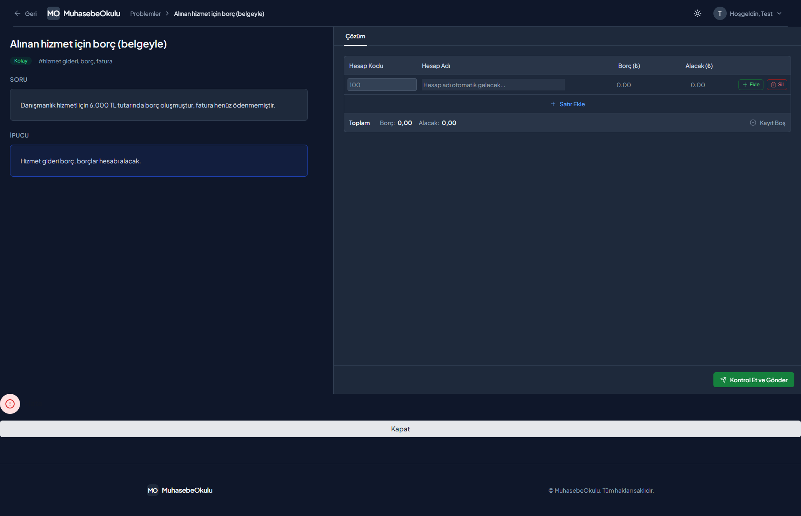
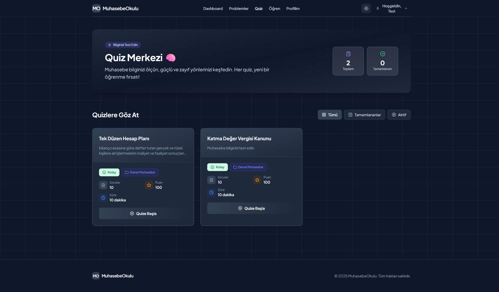
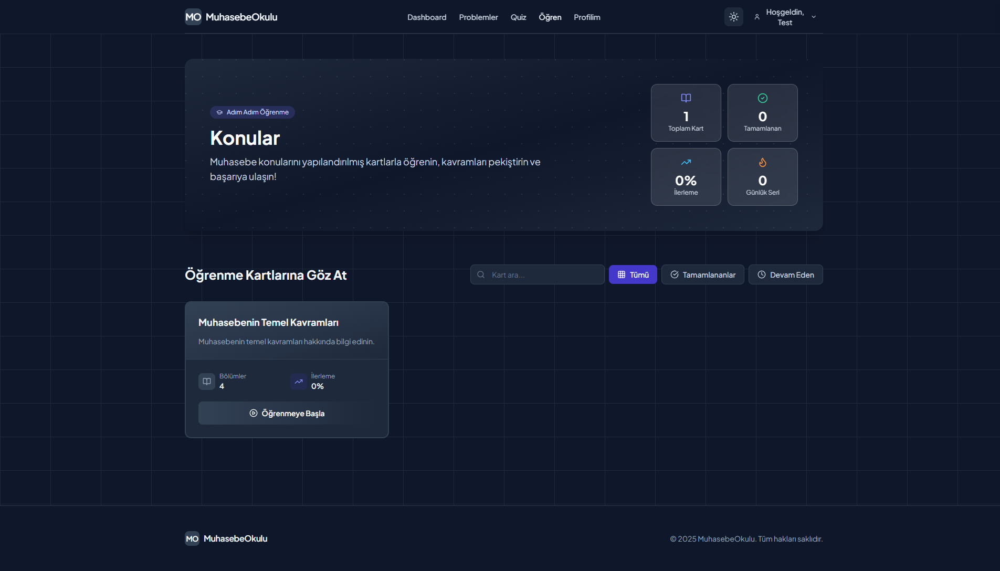

# 📚 MuhasebeOkulu - Muhasebe Eğitim Platformu

> Interaktif muhasebe problemleri, quizler ve çalışma kartları ile pratik yaparak öğrenin.

[](https://spring.io/projects/spring-boot)
[](https://www.oracle.com/java/)
[](https://www.postgresql.org/)
[](LICENSE)

## 📋 İçindekiler

- [Özellikler](#-özellikler)
- [Teknoloji Stack](#-teknoloji-stack)
- [Ekran Görüntüleri](#-ekran-görüntüleri)
- [Kurulum](#-kurulum)
- [Kullanım](#-kullanım)
- [API Dokümantasyonu](#-api-dokümantasyonu)
- [Veritabanı Yapısı](#-veritabanı-yapısı)
- [Proje Yapısı](#-proje-yapısı)
- [Katkıda Bulunma](#-katkıda-bulunma)
- [Lisans](#-lisans)

## ✨ Özellikler

### 👨‍🎓 Öğrenci Özellikleri
- 📝 **Problem Çözme**: Gerçek dünya senaryoları ile yevmiye kayıtları yapma pratiği
- 🎯 **Quiz Sistemi**: Çoktan seçmeli sorularla anlık geri bildirim
- 📖 **Çalışma Kartları**: Konu bazlı öğrenme materyalleri
- 📊 **İlerleme Takibi**: Kişisel dashboard ile performans analizi
- 💬 **Tartışma Forumu**: Problemler hakkında soru sorma ve tartışma
- 🏆 **Başarı Sistemi**: Çözülen problemlere göre puan ve rozetler

### 👨‍🏫 Admin Özellikleri
- 👥 **Kullanıcı Yönetimi**: Kullanıcı oluşturma, düzenleme ve rol atama
- 📚 **İçerik Yönetimi**: Problem, quiz ve çalışma kartı oluşturma
- 📈 **Analitik Dashboard**: Platform geneli istatistikler ve raporlar
- 🔧 **Sistem Yönetimi**: Veritabanı optimizasyonu ve bakım araçları

### 🔐 Güvenlik
- JWT tabanlı authentication
- BCrypt şifre hashleme
- Role-based access control (USER, ADMIN)
- CORS yapılandırması

## 🛠 Teknoloji Stack

### Backend
- **Framework**: Spring Boot 3.5.7
- **Language**: Java 17
- **Database**: PostgreSQL 15
- **ORM**: Hibernate / JPA
- **Migration**: Flyway
- **Security**: Spring Security + JWT
- **Documentation**: Swagger / OpenAPI 3.0
- **Build Tool**: Maven

### Frontend
- **Framework**: Vanilla JavaScript (ES6+)
- **Styling**: Tailwind CSS 3.x
- **Icons**: Lucide Icons
- **Charts**: Chart.js
- **Architecture**: SPA (Single Page Application)

### DevOps
- **Connection Pool**: HikariCP
- **Database Indexes**: Optimized queries
- **Logging**: SLF4J + Logback

## 📸 Ekran Görüntüleri

### Ana Sayfa

*Modern ve kullanıcı dostu ana sayfa tasarımı*

### Dashboard

*Kişisel ilerleme takibi ve istatistikler*

### Problem Çözme

*İnteraktif problem çözme arayüzü*

### Quiz Sistemi

*Çoktan seçmeli quiz arayüzü*

### Çalışma Kartları

*Konu bazlı öğrenme materyalleri*

### Profil Sayfası

*Kullanıcı profili ve ayarlar*

### Admin Panel

*Kapsamlı admin yönetim paneli*

### Admin Dashboard

*Sistem geneli analitik ve raporlar*

## 🚀 Kurulum

### Gereksinimler
- Java 17 veya üzeri
- PostgreSQL 15 veya üzeri
- Maven 3.8 veya üzeri
- 2GB RAM (minimum)

### 1. Projeyi Klonlayın
```bash
git clone https://github.com/abdulkerimcetinkaya/muhasebe-okulu.git
cd muhasebe-okulu
```

### 2. PostgreSQL Veritabanını Oluşturun
```sql
CREATE DATABASE "muhasebe-okulu";
CREATE USER your_username WITH PASSWORD 'your_secure_password';
GRANT ALL PRIVILEGES ON DATABASE "muhasebe-okulu" TO your_username;
```

### 3. Environment Variables Yapılandırın (Önerilen)

**Güvenlik için environment variables kullanın:**

```bash
# .env.example dosyasını kopyalayın
cp .env.example .env

# .env dosyasını düzenleyin ve güvenli değerler girin
nano .env  # veya herhangi bir editör
```

**`.env` dosyası içeriği:**
```env
DB_HOST=localhost
DB_PORT=5432
DB_NAME=muhasebe-okulu
DB_USERNAME=your_username
DB_PASSWORD=your_secure_password_min_12_chars
JWT_SECRET=your_random_32_character_secret_key
```

**VEYA application.properties'i düzenleyin** (Hızlı test için):
```properties
spring.datasource.url=jdbc:postgresql://localhost:5432/muhasebe-okulu
spring.datasource.username=your_username
spring.datasource.password=your_secure_password
```

**⚠️ GÜVENLİK UYARISI**:
- ✅ **Environment variables kullanın** (production için zorunlu)
- ✅ **Güçlü şifreler** (min 12 karakter, mixed case, numbers, symbols)
- ✅ **JWT secret'ı değiştirin** (min 32 karakter, random)
- ❌ **Asla .env dosyasını Git'e commit etmeyin** (.gitignore'da)
- ❌ **Varsayılan şifreleri production'da kullanmayın**

### 4. Projeyi Derleyin ve Çalıştırın
```bash
# Maven wrapper ile derleme
./mvnw clean install

# Uygulamayı başlatın
./mvnw spring-boot:run
```

### 5. Tarayıcıda Açın
```
http://localhost:8080
```

## 📖 Kullanım

### İlk Kullanıcı Oluşturma
1. Ana sayfada **"Kayıt Ol"** butonuna tıklayın
2. Kullanıcı bilgilerinizi girin
3. İlk kayıt olan kullanıcı otomatik olarak **ADMIN** rolü alır

### Problem Çözme
1. Dashboard'dan **"Problemler"** sekmesine gidin
2. Bir problem seçin
3. Yevmiye kayıtlarınızı yapın:
   - Hesap kodu seçin
   - Borç/Alacak tutarlarını girin
   - Açıklama ekleyin
4. **"Çözümü Kontrol Et"** butonuna tıklayın

### Quiz Çözme
1. **"Quizler"** sekmesine gidin
2. Bir quiz seçin
3. Soruları yanıtlayın
4. **"Gönder"** ile sonuçlarınızı görün

### Admin İşlemleri
1. Admin hesabıyla giriş yapın
2. **"Admin Panel"** menüsüne gidin
3. Kullanıcı, problem, quiz veya çalışma kartı yönetimi yapın

## 📡 API Dokümantasyonu

### Swagger UI
Uygulama çalışırken API dokümantasyonuna erişin:
```
http://localhost:8080/swagger-ui.html
```

### Temel Endpoint'ler

#### Authentication
```http
POST /api/auth/register     # Yeni kullanıcı kaydı
POST /api/auth/login        # Kullanıcı girişi
```

#### Problems
```http
GET    /api/problems              # Tüm problemleri listele
GET    /api/problems/{id}         # Problem detayı
POST   /api/problems              # Yeni problem oluştur (Admin)
PUT    /api/problems/{id}         # Problem güncelle (Admin)
DELETE /api/problems/{id}         # Problem sil (Admin)
```

#### Solved Problems
```http
GET  /api/solved-problems                    # Çözülen problemler
POST /api/solved-problems/check              # Çözüm kontrolü
GET  /api/solved-problems/user/{userId}      # Kullanıcının çözümleri
```

#### Quizzes
```http
GET  /api/quizzes                # Tüm quizleri listele
GET  /api/quizzes/{id}           # Quiz detayı
POST /api/quizzes                # Yeni quiz oluştur (Admin)
POST /api/quizzes/{id}/submit    # Quiz gönder
```

#### Users
```http
GET    /api/users/{id}/profile   # Kullanıcı profili
PUT    /api/users/{id}/profile   # Profil güncelle
PUT    /api/users/{id}/password  # Şifre değiştir
```

**Admin Endpoints**: Admin paneli endpoint'leri gizlilik nedeniyle dokümante edilmemiştir.
Detaylar için Swagger UI'ı kullanın: `http://localhost:8080/swagger-ui.html`

### JWT Authentication
Korumalı endpoint'lere erişmek için Authorization header'ı ekleyin:
```http
Authorization: Bearer <your-jwt-token>
```

## 🗄 Veritabanı Yapısı

### Ana Tablolar

#### users
Kullanıcı bilgileri ve authentication
```sql
- id (PK)
- username (UNIQUE)
- email (UNIQUE)
- password (BCrypt)
- role (USER/ADMIN)
- first_name, last_name
- profession
- created_at
```

#### problems
Muhasebe problemleri
```sql
- id (PK)
- title
- description
- difficulty (KOLAY/ORTA/ZOR)
- category
- points
- created_at
```

#### correct_entries
Problemlerin doğru çözümleri
```sql
- id (PK)
- problem_id (FK)
- account_code
- debit_amount
- credit_amount
- entry_type (BORÇ/ALACAK)
```

#### solved_problems
Kullanıcı çözümleri
```sql
- id (PK)
- user_id (FK)
- problem_id (FK)
- solved_at
- is_correct
```

#### quizzes
Quiz soruları
```sql
- id (PK)
- title
- description
- category_id (FK)
- time_limit
```

#### questions & options
Çoktan seçmeli sorular
```sql
questions:
- id (PK)
- quiz_id (FK)
- question_text
- points

options:
- id (PK)
- question_id (FK)
- option_text
- is_correct
```

### Performans İyileştirmeleri
- ✅ Optimized indexes on foreign keys
- ✅ Composite indexes for frequent queries
- ✅ HikariCP connection pooling
- ✅ Lazy loading for entities

## 📁 Proje Yapısı

```
muhasebe-okulu/
├── src/
│   ├── main/
│   │   ├── java/com/example/muhasebeokulu5/
│   │   │   ├── config/              # Yapılandırma sınıfları
│   │   │   ├── controller/          # REST Controllers
│   │   │   ├── dto/                 # Data Transfer Objects
│   │   │   ├── entities/            # JPA Entities
│   │   │   ├── exception/           # Custom Exceptions
│   │   │   ├── repository/          # Spring Data Repositories
│   │   │   ├── security/            # JWT & Security
│   │   │   └── service/             # Business Logic
│   │   └── resources/
│   │       ├── db/migration/        # Flyway migrations
│   │       ├── static/              # Frontend files
│   │       │   ├── assets/
│   │       │   │   ├── css/
│   │       │   │   ├── js/
│   │       │   │   └── templates/
│   │       │   ├── *.html           # HTML pages
│   │       └── application.properties
│   └── test/                        # Unit & Integration tests
├── screenshots/                     # Ekran görüntüleri
├── .gitignore
├── pom.xml
├── mvnw, mvnw.cmd
├── CLAUDE.md                        # AI asistan kılavuzu
└── README.md
```

## 🎨 Frontend Yapısı

### Sayfa Yapısı
- `index.html` - Ana sayfa
- `login.html`, `register.html` - Authentication
- `dashboard.html` - Kullanıcı dashboard
- `problems.html`, `problem-detail.html` - Problem çözme
- `quizzes.html`, `quiz-detail.html` - Quiz sistemi
- `study.html`, `study-detail.html` - Çalışma kartları
- `profile.html` - Kullanıcı profili
- `admin.html`, `admin-dashboard.html` - Admin panel

### JavaScript Modülleri
- `common.js` - Ortak utility fonksiyonlar
- `api.js` - API çağrı wrapper'ları
- `auth.js` - Authentication işlemleri
- `pages/*.js` - Sayfa özel logic

### CSS Yapısı
- Tailwind CSS utility-first approach
- Custom components in `components.css`
- Responsive design (mobile-first)

## 🧪 Test

### Unit Test Çalıştırma
```bash
./mvnw test
```

### Belirli Bir Test Class'ı Çalıştırma
```bash
./mvnw test -Dtest=TestClassName
```

### Test Coverage
```bash
./mvnw clean test jacoco:report
```

## 🔧 Geliştirme

### Hot Reload (DevTools)
Spring Boot DevTools etkinleştirilmiştir. Frontend değişiklikleri tarayıcıda yenileyerek görülebilir.

### Database Migration
Yeni migration oluşturmak için:
```bash
# src/main/resources/db/migration/ klasörüne
# V{VERSION}__description.sql formatında dosya ekleyin
```

### Loglama
Log seviyelerini `application.properties` dosyasından ayarlayın:
```properties
logging.level.com.example.muhasebeokulu5=DEBUG
```

## 🐛 Bilinen Sorunlar ve Çözümler

### Port 8080 Zaten Kullanımda
```bash
# Windows
netstat -ano | findstr :8080
taskkill /F /PID <process-id>

# Linux/Mac
lsof -i :8080
kill -9 <process-id>
```

### Veritabanı Connection Hatası
- PostgreSQL servisinin çalıştığından emin olun
- Kullanıcı adı ve şifreyi kontrol edin
- `application.properties` dosyasındaki URL'i doğrulayın

## 🤝 Katkıda Bulunma

Katkılarınızı bekliyoruz! Lütfen şu adımları izleyin:

1. Fork yapın
2. Feature branch oluşturun (`git checkout -b feature/amazing-feature`)
3. Değişikliklerinizi commit edin (`git commit -m 'feat: Add amazing feature'`)
4. Branch'inizi push edin (`git push origin feature/amazing-feature`)
5. Pull Request açın

### Commit Mesaj Formatı
```
feat: Yeni özellik
fix: Hata düzeltmesi
docs: Dokümantasyon değişikliği
style: Kod formatı (mantıksal değişiklik yok)
refactor: Kod refactoring
test: Test ekleme/düzeltme
chore: Build veya yardımcı araç değişiklikleri
```

## 📝 Lisans

Bu proje MIT lisansı altında lisanslanmıştır. Detaylar için [LICENSE](LICENSE) dosyasına bakın.

## 👥 İletişim

- **Proje Sahibi**: Abdul Kerim Çetinkaya
- **GitHub**: [@abdulkerimcetinkaya](https://github.com/abdulkerimcetinkaya)
- **Proje Linki**: [https://github.com/abdulkerimcetinkaya/muhasebe-okulu](https://github.com/abdulkerimcetinkaya/muhasebe-okulu)

## 🙏 Teşekkürler

- [Spring Boot](https://spring.io/projects/spring-boot) - Backend framework
- [Tailwind CSS](https://tailwindcss.com/) - CSS framework
- [Lucide Icons](https://lucide.dev/) - Icon set
- [Chart.js](https://www.chartjs.org/) - Charting library
- [Claude Code](https://claude.com/claude-code) - AI-assisted development

---

⭐ Bu projeyi beğendiyseniz yıldız vermeyi unutmayın!
